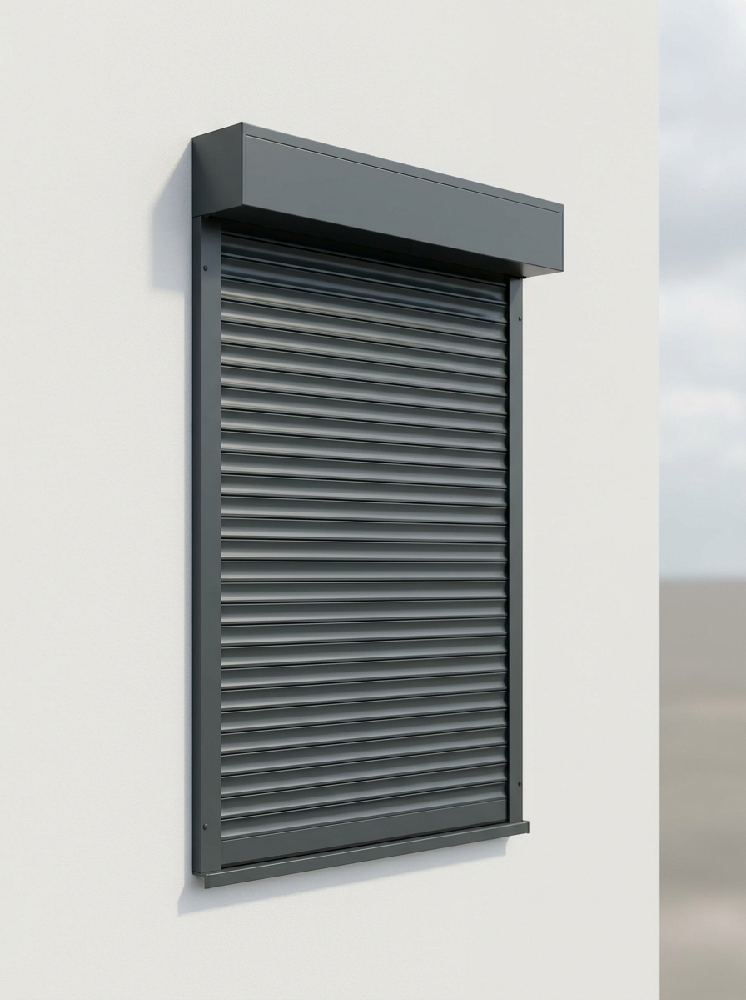

# AI-rolluiken voor de configurator — afmaken in een Full-netwerk sessie

De realistische rolluik-renders zijn op 2026-06-14 gegenereerd met Higgsfield
(model `marketing_studio_image`, 3:4). Deze sessie kon ze **niet downloaden**
(netwerk "Trusted"). Maak dit af in een sessie met **Network access = Full**.

> ⚠️ De CloudFront-links hieronder kunnen na verloop van tijd verlopen. Voer dit
> bij voorkeur snel uit. Verlopen ze toch? Open `AI-IMAGES-TODO` opnieuw en haal
> verse URLs op via `mcp__higgsfield__job_display` met de job-id's in de tabel.

## Stap 1 — Download de 6 beelden (kant-en-klaar)

```bash
cd lucky-demo/assets
B="https://d8j0ntlcm91z4.cloudfront.net/user_3EdpNOPjrEuN7grAEkmSnZzolrU"
curl -L "$B/hf_20260614_120646_90ea7fe7-82c0-47df-8f81-1cd9263e5679.png" -o rolluik-antraciet.png
curl -L "$B/hf_20260614_121135_c08397b7-04d9-456d-a24a-efd84687f1d5.png" -o rolluik-zwart.png
curl -L "$B/hf_20260614_121137_481077bd-2385-4045-9f4e-780a3ce7c987.png" -o rolluik-wit.png
curl -L "$B/hf_20260614_121139_228ff701-0ce1-48f3-b8d3-a73dd51c8a36.png" -o rolluik-creme.png
curl -L "$B/hf_20260614_121140_f3aad278-5ea7-4cae-87ab-29f5e836c3a2.png" -o rolluik-grijs.png
curl -L "$B/hf_20260614_121142_9c9fdab8-41e7-4a29-8ef4-c9dc0b774db1.png" -o rolluik-bruin.png
```

| Kleur | RAL | Bestand | job-id (voor verse URL) |
| :--- | :--- | :--- | :--- |
| Antraciet | 7016 | `rolluik-antraciet.png` | `90ea7fe7-82c0-47df-8f81-1cd9263e5679` |
| Zwart | 9005 | `rolluik-zwart.png` | `c08397b7-04d9-456d-a24a-efd84687f1d5` |
| Wit | 9010 | `rolluik-wit.png` | `481077bd-2385-4045-9f4e-780a3ce7c987` |
| Crèmewit | 9001 | `rolluik-creme.png` | `228ff701-0ce1-48f3-b8d3-a73dd51c8a36` |
| Grijs | 7038 | `rolluik-grijs.png` | `f3aad278-5ea7-4cae-87ab-29f5e836c3a2` |
| Bruin | 8014 | `rolluik-bruin.png` | `9c9fdab8-41e7-4a29-8ef4-c9dc0b774db1` |

## Stap 2 — Configurator op foto's zetten (`configurator.html`)

Vervang de inline `#rolluikSvg` (de hele `<svg>…</svg>`) door:

```html

```

Geef elke kleurstaal én thumbnail een `data-img` naast de bestaande `data-color`:

```
data-color="#3a4651" data-img="assets/rolluik-antraciet.png"
data-color="#232323" data-img="assets/rolluik-zwart.png"
data-color="#e9e6df" data-img="assets/rolluik-creme.png"
data-color="#f4f4f4" data-img="assets/rolluik-wit.png"
data-color="#8a939b" data-img="assets/rolluik-grijs.png"
data-color="#5a4632" data-img="assets/rolluik-bruin.png"
```

## Stap 3 — Wisselen in `assets/app.js`

In de bestaande klik-handler van `[data-color]` toevoegen:

```js
var img = sw.getAttribute('data-img');
var photo = document.getElementById('rolluikPhoto');
if (img && photo) photo.src = img;
```

(De `applyRolluikColor`-SVG-logica mag blijven staan als nette fallback.)

## Stap 4 — Publiceren

Commit op `claude/modest-bardeen-2dkplw`, en sync de `/lucky`-map op de
`gh-pages` branch (zoals eerder gedaan in deze repo).

> AI-beelden zijn rechtenvrij gegenereerd, maar geen foto's van Lucky's eigen
> producten. Voor de definitieve site eventueel vervangen door echte
> productfoto's van Lucky.
